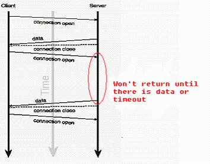

## $\color{#ff00ff}{前端如何实现即时通讯}$

### 思路分析
1. 为什么前端需要即时通讯
2. 前端即时通讯的方法有几种

### 回答参考
1. 在后端接收到某些指令时造成某些数据状态发生改变时，前端需要做出响应（$\color{red}{弹窗}$， $\color{red}{预警消息}$等），而不是刷新页面
2. 前端即时通讯的方法大致可分为 4 种：$\color{#00a361}{传统Ajax短轮询}$，$\color{#00a361}{Comet技术}$，$\color{#00a361}{WebSocket技术}$，$\color{#00a361}{SSE(Server \ Sent \ Events)}$。
    * $\color{#00a361}{传统Ajax短轮询}$
        - 客户端每隔一段时间发出一个请求，获取服务器最新的数据，在一定程度上实现了即时通讯。
        - 优点：兼容性高，实现非常简单。
        - 缺点：延迟性高，十分消耗请求资源，影响性能，容易造成页面卡顿。也不是真正意义上的实时通讯。
        ```
        // 在 vue 中
        poll() {
          let timer = setInterval(() => {
            axios.post(
              '/test',
              params
            ).then(res => {
              // 处理结果 - res
              console.log(res);
            }).catch(err => {
              clearInterval(timer)
            })
          }, 2000); //  隔 2s 发送一次请求
        }
        ```
    *  $\color{#00a361}{Comet技术}$
        - $\color{#00a361}{基于AJAX的长轮询}$
            - 服务器阻塞请求，一直到有数据传递(客户端请求的数据发生改变)或者超时才返回。
            - 客户端在响应处理函数在处理完服务器返回的信息后，再次发起请求，重新建立连接。
            - 客户端处理接收的数据时，重新建立连接时，服务器可能会有新的数据到达（这些信息会被服务器保存直到客户端重新建立连接，一次性把服务器所有的信息取回）。
            - 应用场景：网站通过移动端进行二维码登录，成功后浏览器页面自动响应跳转进入一个新的登录页面。（短轮询也可）
            
            ```
            longPoll() {
              axios.post(
                '/test',
                params,
                {
                  timeout: 10000
                }
              ).then(res => {
                console.log(res);
                this.longPoll()
              }).catch(err => {
                if(err.message.includes('timeout')) {
                  this.longPoll();
                } else {
                  console.log(err)
                }
              })
            }
            ```
        * 基于 $\color{#00a361}{XHR}$ 对象的 $\color{#00a361}{streaming}$ 方式
            - 构造一个 XHR 对象，通过监听它的 $\color{#ee7b1d}{onreadystatechange}$ 事件，当它的 $\color{#ee7b1d}{readyState}$ 为 $\color{#ee7b1d}{3}$ 时，获取它的 $\color{#ee7b1d}{responseText}$ 然后进行处理；$\color{#ee7b1d}{readyState}$ 为 $\color{#ee7b1d}{3}$ 表示数据正在传送，整个通信过程还没有结束，还可以不断获取数据，直到 $\color{#ee7b1d}{readyState}$ 为 $\color{#ee7b1d}{4}$ 时才表示数据发送完毕。在这个过程中，服务端传送给客户端的数据是分多次 以 $\color{#ee7b1d}{stream}$ 的形式，客户端也是通过 $\color{#ee7b1d}{stram
            }$ 形式接收的，称为 $\color{#ee7b1d}{http-stream \ 数据流}$方式。
            - $\color{#ee7b1d}{'content-type': \ 'multipart/octet-stream'}$
        * 基于 $\color{#00a361}{Iframe}$的流（$\color{#00a361}{streaming}$）方式
            - Iframe 是 html 标记，这个标记的 src 属性会保持对指定服务器的长连接请求，服务端则可以不停地返回数据。
            - 通过返回数据中嵌入 JS 脚本的方式。比如："\<script type='text/javascript'>parent.handleYyg('server - data')\</script>"，服务端将返回的数据作为回调函数的参数，浏览器在收到数据后就会执行这段 JS 脚本。
            - 缺点：在一部分浏览器上加载进度会显示没有完成， IE 上t标签页图标会不停的转动；长期占用连接，丧失了无状态高并发的特点。
        * 基于 $\color{#00a361}{htmlfile}$ 的流（$\color{#00a361}{streaming}$）方式
            - 在 IE 中，使用 $\color{#ee7b1d}{iframe}$ 请求服务端，服务端保持通信连接没有全部返回之前，浏览器 title 一直处于加载状态，并且底部也显示正在加载；
            - 动态生成一个 $\color{#ee7b1d}{htmlfile}$ 对象，这个对象 $\color{#ee7b1d}{ActiveX}$ 形式的 $\color{#ee7b1d}{com}$ 组件。 （它实际上就是一个在内存中实现的 HTML 文档，通过将生成的 iframe 添加到这个内存中的 HTMLfile 中，并利用 iframe 的数据流通信方式达到上面的效果），同时由于 $\color{#ee7b1d}{htmlfile}$ 对象并不是直接添加到页面上的，所以并没有造成浏览器显示正在加载的现象。
            ```
            function cometHtmlFile(url, callback) {
              var tDom = new ActiveXObject("htmlfile");
              tDom.open();
              tDom.write('<!DOCTYPE html><html><body><script  type="text/javascript"> ' + "document.domain='" + document.domain + "' ; " + '<\/script><\/body><\/html>')
              tDom.close();
              var tDiv = tDom.createElement('div');
              tDom.body.appendChild(tDiv);
              tDiv.innerHTML = "<iframe src='" + url + "' ><\/iframe> ";
              tDom.callback = callback;
              setInterval(function () { }, 10000);
            };
            function handleYyg(data) {
              console.log("data--", data);
            };
            cometHtmlFile('http://localhost:3444/htmlfile', handleYyg)
            ```
        * $\color{red}{使用comet技术需要注意点：}$
            - 不要在同一客户端同时使用超过两个 $\color{red}{http}$ 长期占用连接
            - 服务器端的性能以及可扩展性
            - **控制类信息** 与 **数据展示类信息** 使用不同的 $\color{red}{http}$ 连接
        * $\color{#00a361}{WebSocket}$
            - 优点：支持真正意义的双向实时通信；兼容性好，支持大部分浏览器；无需客户端手动发送数据请求。
            - 缺点：对服务器和网络的要求较高；不支持 $\color{red}{IE10}$ 以下浏览器
          ```
          // 客户端
          const socket = new WebSocket('ws://localhost:3444');
          socket.onmessage = function(e) {
            const data = e.data;
            // 处理数据
          };
          socket.send("yyg-send");


          // 服务端
          const WebSocket = require("ws");
          const serve = new WebSocket.Server({port: 3444});
          server.on("connection", function(socket) {
            socket.on("message", function(data) {
              //  处理数据
              socket.send(data);
            })
          })
          ```
      * [$\color{#00a361}{SSE(Server \ Send \ Events)}$](https://developer.mozilla.org/en-US/docs/Web/API/EventSource)，是一种允许服务端客户端推送新数据的 $\color{#ee7b1d}{HTML5}$ 技术。
          - 单项数据通信
          - 应用场景：新闻推送，实时天气等只需要服务器发送，客户端接收的场景
          - $\color{#ee7b1d}{EventSource}$ 对象
          - $\color{#ee7b1d}{"Content-Type": "text/event-stream"}$
          - 和 $\color{#ff00ff}{WebSocket}$ 的区别
          - |  | $\color{#ff00ff}{WebSocket}$ | $\color{#00a361}{SSE}$ |
            | :---: | :---: | :---: |
            | 协议 |  基于 TCP | 基于 HTTP |
            | 通信方式 |  双向通信 | 单向通信 |
            | 数据类型 |  支持发送二进制 | 只支持文本 |
            | 资源占用 | 占用过大 | 更轻量 |
            | 跨域 | 可以跨域 | 需要服务端设置请求头 |
            |其他|--|有自动重连(不借助第三方)/发送随机事件的能力|