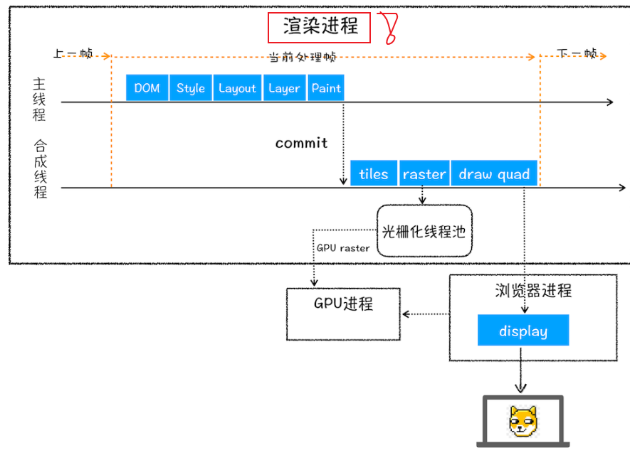

<!--
 * @Author: fulangren 1746575462@qq.com
 * @Date: 2023-11-30 11:48:24
 * @LastEditors: fulangren 1746575462@qq.com
 * @LastEditTime: 2023-11-30 14:51:44
 * @FilePath: \question-Interview\brower\003-url-to-view\README.md
 * @Description: 这是默认设置,请设置`customMade`, 打开koroFileHeader查看配置 进行设置: https://github.com/OBKoro1/koro1FileHeader/wiki/%E9%85%8D%E7%BD%AE
-->
## $\color{#ff00ff}{从输入URL到页面呈现发生了什么}$

### 思路分析
1. 在网络请求过程中发生了什么
2. 获取到资源页面渲染发生了什么

### 回答参考
1. $\color{#00a361}{网络请求方面}$
    * $\color{#ee7b1d}{构建请求}$ (浏览器构建请求行)
    * $\color{#ee7b1d}{查找强缓存}$。如果命中强缓存, 直接使用;未命中强缓存, 走下一步
    * $\color{#ee7b1d}{DNS(域名)解析}$ 
    * $\color{#ee7b1d}{建立TCP连接}$ 
        - Chrome 在同一个域名下要求同时最多只能有 6 个 TCP 连接，超过 6 个的话剩下的请求就得等待。
        - TCP（Transmission Control Protocol，传输控制协议）是一种面向连接的、可靠的、基于字节流的传输层通信协议。
        - 建立 $\color{#ee7b1d}{TCP连接}$ 经历了下面三个阶段:
        > 1) 通过 $\color{#aaafff}{三次握手}$ (即总共发送3个数据包确认已经建立连接)建立客户端和服务器之间的连接。
        > 2) 进行 $\color{#aaafff}{数据传输}$。这里有一个重要的机制 $\color{red}{(数据包校验)}$，就是接收方接收到数据包后必须要向发送方确认, 如果发送方没有接到这个确认的消息，就判定为数据包丢失，并重新发送该数据包。当然，发送的过程中还有一个优化策略，就是把大的数据包拆成一个个小包，依次传输到接收方，接收方按照这个小包的顺序把它们组装成完整数据包。
        > 3) $\color{#aaafff}{断开连接}$ 阶段。数据传输完成，现在要断开连接了，通过四次挥手来断开连接。
    * $\color{#ee7b1d}{发送 HTTP 请求}$
        - 发 HTTP 请求要携带三样东西: 请求行、请求头和请求体。
            + 请求行: ```GET /HTTP/1.1``` 由请求方法、请求URL 和
 HTTP版本协议组成
            + 请求头: 我们之前说的Cache-Control、If-Modified-Since、If-None-Match、Cookie都可能被放入请求头中作为缓存的标识信息
            + 请求体: 存在于post请求存在(表单提交)
    * $\color{#ee7b1d}{网络响应}$
        - 连接已经建立, 请求也已经发出, 接下来就是得到请求的网络响应结果
        - 网络响应具有三个部分: 响应行、响应头和响应体
            + 响应行: ```HTTP/1.1  200 OK``` 由HTTP协议版本、状态码 和 状态描述组成
            + 响应头: 包含Cache-Control、Connection、Content-Type、Date等信息，其中 $\color{red}{Connection: Keep-Alive}$ 表示建立了持久连接，这样TCP连接会一直保持，之后请求统一站点的资源会复用这个连接; 否则断开 TCP 连接, 到此请求-响应流程结束
            + 响应结果

2. $\color{#00a361}{页面渲染}$
    * 完成了请求并获取到结果响应, 如果响应头中 $\color{red}{Content-Type}$ 的值是 $\color{red}{text/html}$, 接下来就是浏览器的 $\color{#ee7b1d}{解析}$ 和 $\color{#ee7b1d}{渲染}$ 工作了。
    * $\color{#ee7b1d}{解析部分: }$
        - 构建DOM树
        >浏览器无法识别HTML, 需要经过HTML解析器输出为DOM树保存在内存结构中
        - 样式计算
        >将css样式转换成浏览器可以理解的结构(styleSheets)
        - 生成布局树
        > 1) 遍历 DOM 树中所有 $\color{red}{可见节点}$, 并把这些节点加入到布局树中
        > 2) 而$\color{red}{不可见节点}$会被布局树忽略掉，如 head 标签下面的全部内容，再比如 body.p.span 这个元素，因为它的属性包含 dispaly:none，所以这个元素也没有被加入布局树。
    * $\color{#ee7b1d}{渲染过程:}$
        - 对布局树进行分层，并生成分层树
        - 为每个图层生成绘制列表，并将其提交到合成线程。
        - 合成线程将图层分成图块，并在光栅化线程池中将图块转换成位图。
        - 合成线程发送绘制图块命令 DrawQuad 给浏览器进程。
        - 浏览器进程根据 DrawQuad 消息生成页面，并显示到显示器上。
[上述图片来源](https://blog.csdn.net/weixin_49021723/article/details/128373053)