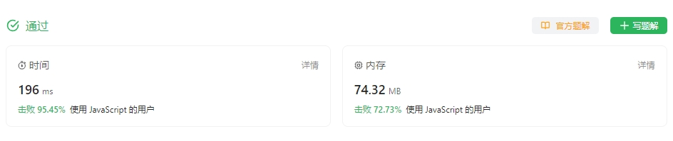

<!--
 * @Author: fulangren 1746575462@qq.com
 * @Date: 2023-12-01 15:52:31
 * @LastEditors: fulangren 1746575462@qq.com
 * @LastEditTime: 2023-12-01 16:08:51
 * @FilePath: \question-Interview\yyg-algorithm\2023-12-01\README.md
 * @Description: 这是默认设置,请设置`customMade`, 打开koroFileHeader查看配置 进行设置: https://github.com/OBKoro1/koro1FileHeader/wiki/%E9%85%8D%E7%BD%AE
-->
### $\color{#ff00ff}{找出叠涂元素}$

#### 问题描述
给你一个下标从 **0** 开始的整数数组 ```arr``` 和一个 ```m x n``` 的整数 **矩阵** ```mat``` 。```arr``` 和 ```mat``` 都包含范围 ```[1, m * n]``` 内的 **所有** 整数。

从下标 **0** 开始遍历 ```arr``` 中的每个下标 ```i``` ，并将包含整数 ```arr[i]``` 的 ```mat``` 单元格涂色

请你找出 ```arr``` 中在 ```mat``` 的某一行或某一列上都被涂色且下标最小的元素，并返回其下标 ```i``` 。

#### 思路分析
1. 目的是为了 ```mat``` 矩阵中 某一行或者某一列 涂满了颜色，那就需要知道 ```arr``` 的每一个元素在 矩阵中的位置。哈希表记录 ```mat``` 矩阵位置上的元素（元素的坐标）。 
2. 哈希表完善之后，在遍历 ```arr``` 的时候需要记录/检查 矩阵某一行/某一列是否涂满。

#### 代码参考
```
var firstCompleteIndex = function (arr, mat) {
  let n = mat.length, m = mat[0].length;
  let yygMap = new Map();
  for (let i = 0; i < n; i++) {
    for (let j = 0; j < m; j++) {
      yygMap.set(mat[i][j], [i, j]);  //  记录下mat矩阵每个元素的坐标
    }
  }
  let n_l = Array(n).fill(0), m_l = Array(m).fill(0);
  for (let i = 0, len = arr.length; i < len; i++) {
    let pos = yygMap.get(arr[i]);
    if(++n_l[pos[0]] >= m || ++m_l[pos[1]] >=n){
      return i
    }
  }
};

let res = firstCompleteIndex([2,8,7,4,1,3,5,6,9], [[3,2,5],[1,4,6],[8,7,9]]);
console.log(res); //  3
```
